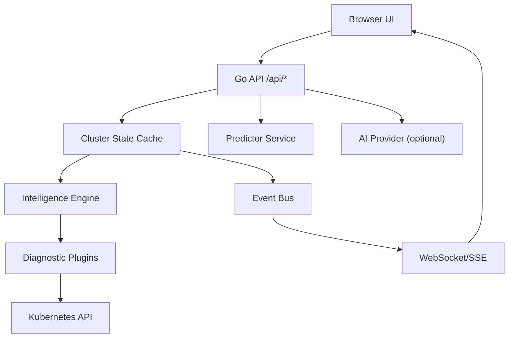

# KubeLens AI

AI-powered Kubernetes operations assistant for deterministic diagnostics and root-cause analysis.

**Stack:** React + Vite, Go API, FastAPI predictor, Kustomize overlays, Helm.

---

## Product vision

KubeLens AI helps engineers diagnose cluster issues, understand failures, and optimize workloads. The differentiator is a deterministic cluster intelligence engine that produces structured diagnostics. The AI layer explains those diagnostics and suggests safe remediation steps.

---

## Feature reference

For a complete feature-by-feature breakdown (all views, workflows, and backing APIs), see [docs/FEATURES.md](docs/FEATURES.md).

---

## Architecture



---

## Screenshots (Latest)

| UI 1                                                                | UI 2                                                                | UI 3                                                                |
| ------------------------------------------------------------------- | ------------------------------------------------------------------- | ------------------------------------------------------------------- |
|   |   |   |
|   |   |   |
|   |   |   |
|  |  |  |
|  |  |  |

---

## What it does

| Area                                                                                                            | Detail                                                                                               |
| --------------------------------------------------------------------------------------------------------------- | ---------------------------------------------------------------------------------------------------- |
| \| **Ghost Engine** \| Proactive cluster maintenance simulation (node drain, etc.) with predictive timelines \| |
| \| **Inventory** \| Pods, nodes, deployments, services, ingresses, namespaces, RBAC, events, storage, config \| |
| **Safe operations**                                                                                             | Controlled write actions (restart/scale/rollback/cordon/drain/apply) behind RBAC + global write gate |
| **Diagnostics**                                                                                                 | Deterministic intelligence engine with evidence + recommendations                                    |
| **Predictions**                                                                                                 | Predictor-backed risk scoring with deterministic local fallback                                      |
| **Assistant + RAG**                                                                                             | Deterministic context with optional OpenAI-compatible LLM and documentation grounding                |
| **Incident workflow**                                                                                           | Incident creation, runbook step progression, resolution, and remediation association                 |
| **Remediation workflow**                                                                                        | Proposal, approval, execution, rejection (with four-eyes enforcement in `prod`)                      |
| **Cluster memory**                                                                                              | Runbook and fix-pattern memory for operational learning                                              |
| **Postmortems**                                                                                                 | Generated postmortems from incident timeline + runbook state                                         |
| **Metrics + observability**                                                                                     | API telemetry, Prometheus export, dashboard charts, tracing integration                              |
| **Streaming + audit**                                                                                           | Live stream (SSE/WebSocket) and request-level audit trail                                            |
| **Multi-cluster**                                                                                               | Runtime context switching via named kubeconfig contexts                                              |
| **Alerts**                                                                                                      | Alert dispatch + lifecycle state with Alertmanager/Slack/PagerDuty                                   |

---

## Example diagnostics

```json
{
  "severity": "critical",
  "resource": "payments/payment-api",
  "namespace": "payments",
  "message": "Pod payment-api restarting due to memory limit exceeded.",
  "evidence": ["termination reason: OOMKilled", "restart count: 6", "memory usage exceeded limit"],
  "recommendation": "Increase memory limit or investigate memory leak.",
  "source": "resource-analyzer"
}
```

---

## Quick start

```bash
npm install
npm run dev
```

- Frontend -> `http://localhost:5173`
- Backend -> `http://localhost:3000`

Runs in `demo` mode with mock data. No cluster required, no config needed.

## Local toolchain

- Node.js 20+ and npm 10+ for frontend and repo automation
- Go 1.25+ on `PATH` for backend commands such as `npm run dev:api`, `npm run test:go`, and `npm run ci:backend`
- Python 3.12+ for predictor tests and linting
- `kubectl` and `helm` only for Kubernetes deployment flows

Repo quality gates intentionally ignore local workspace artifacts like `.venv/`, `.postman/`, and cache directories so lint/build output stays focused on repo-owned source files.

---

## Full usage, deploy, and GitHub guide

For the detailed step-by-step guide (daily use, deployment paths, and GitHub workflow), see [RUN_AND_USE.md](RUN_AND_USE.md).

---

## Connect to a real cluster

Provide your kubeconfig as a base64 string:

**Bash:**

```bash
export KUBECONFIG_DATA=$(base64 -w 0 ~/.kube/config)
npm run dev
```

**PowerShell:**

```powershell
$bytes = [System.IO.File]::ReadAllBytes("$HOME\.kube\config")
$env:KUBECONFIG_DATA = [Convert]::ToBase64String($bytes)
npm run dev
```

For CPU/memory metrics, verify Metrics Server is running:

```bash
kubectl top nodes
kubectl top pods -A
```

---

## Modes

| Mode   | Use case              | Auth         | Writes |
| ------ | --------------------- | ------------ | ------ |
| `dev`  | Local engineering     | Off          | Off    |
| `demo` | Safe showcase         | Off          | Off    |
| `prod` | Controlled operations | **Required** | Off    |

Write actions are opt-in in every mode. Enabling writes without auth is rejected at startup. `prod` mode refuses to boot without `AUTH_ENABLED=true` and valid tokens or OIDC configuration.

---

## Auth

Static token auth:

```env
AUTH_ENABLED=true
AUTH_TOKENS=viewer:viewer:token1,operator:operator:token2,admin:admin:token3
```

OIDC/JWT auth:

```env
AUTH_ENABLED=true
AUTH_PROVIDER=google           # google | keycloak | oidc | github
AUTH_OIDC_ISSUER_URL=""         # required for oidc/keycloak
AUTH_OIDC_CLIENT_ID=""          # required when OIDC auth is enabled
AUTH_OIDC_USERNAME_CLAIM=""      # optional (defaults to preferred_username/email)
AUTH_OIDC_ROLE_CLAIM=""          # optional (defaults to roles/role/groups)
AUTH_TRUSTED_PROXY_CIDRS=""      # optional reverse-proxy CIDR allowlist for X-Forwarded-For
```

**Roles:**

| Role       | Permissions                                  |
| ---------- | -------------------------------------------- |
| `viewer`   | Read-only + assistant/stream                 |
| `operator` | viewer + write actions (if globally enabled) |
| `admin`    | operator + policy administration             |

**Transport:**

- Primary: `Authorization: Bearer <token>`
- `X-Auth-Token` header is disabled by default and rejected in `prod`
- Mutating cookie-authenticated requests enforce same-origin checks

---

## Docker

```bash
npm run docker:up    # starts dashboard + predictor
npm run docker:down
```

Or build separately:

```bash
npm run docker:build:predictor
npm run docker:run:predictor
```

---

## Kubernetes deployment

```bash
# Development
kubectl apply -k k8s/overlays/dev

# Demo / showcase
kubectl apply -k k8s/overlays/demo

# Production
kubectl apply -k k8s/overlays/prod

# Tracing (Jaeger)
kubectl apply -k k8s/overlays/tracing

# Observability (Prometheus + Grafana)
kubectl apply -k k8s/overlays/observability
```

Each overlay carries its own RBAC ClusterRole, NetworkPolicy, configmap patches, and probe configuration. Production overlay is read-only by default.

For multi-cluster, provide named contexts:

```env
KUBECONFIG_CONTEXTS=prod:base64data,staging:base64data
```

See [k8s/README.md](k8s/README.md) for full deployment reference.

---

## Helm chart

A minimal Helm chart is available in `helm/kubelens`:

```bash
helm install kubelens ./helm/kubelens
```

---

## Predictor service

The predictor service is optional. It scores incident risk using deterministic signals and CPU trend detection (from node history). If it is unavailable, the backend falls back to local predictions.

```env
PREDICTOR_BASE_URL=http://localhost:8001
PREDICTOR_SHARED_SECRET=your-shared-secret
```

---

## Ops assistant

Optional. Configure any OpenAI-compatible provider:

```env
ASSISTANT_PROVIDER=openai_compatible
ASSISTANT_API_KEY=sk-...
ASSISTANT_MODEL=gpt-4o
ASSISTANT_RAG_ENABLED=true   # grounds responses in Kubernetes docs
```

Leave `ASSISTANT_PROVIDER=none` to disable entirely.

Local Ollama (no code changes required):

```bash
curl -fsSL https://ollama.com/install.sh | sh
ollama pull llama3.2
```

```env
ASSISTANT_PROVIDER=openai_compatible
ASSISTANT_API_BASE_URL=http://localhost:11434/v1
ASSISTANT_MODEL=llama3.2
ASSISTANT_API_KEY=ollama
```

RAG embeddings (optional):

```env
ASSISTANT_EMBEDDING_MODEL=nomic-embed-text
ASSISTANT_EMBEDDING_BASE_URL=http://localhost:11434/v1
# ASSISTANT_EMBEDDING_API_KEY defaults to ASSISTANT_API_KEY
```

---

## Observability

| Endpoint                      | Description                                                 |
| ----------------------------- | ----------------------------------------------------------- |
| `GET /api/healthz`            | Liveness                                                    |
| `GET /api/readyz`             | Readiness + cluster/predictor/auth checks (503 if degraded) |
| `GET /api/metrics`            | JSON request telemetry                                      |
| `GET /api/metrics/prometheus` | Prometheus exposition format                                |
| `GET /api/openapi.yaml`       | Published API contract                                      |

Grafana + Prometheus are available via the `observability` overlay.

---

## Tracing (OpenTelemetry)

The API and predictor emit OpenTelemetry traces when an OTLP endpoint is configured.

Environment variables:

```text
OTEL_EXPORTER_OTLP_ENDPOINT=host:port
OTEL_EXPORTER_OTLP_PROTOCOL=grpc
OTEL_EXPORTER_OTLP_INSECURE=true
OTEL_SERVICE_NAME=kubelens-backend
OTEL_PREDICTOR_SERVICE_NAME=kubelens-predictor
OTEL_TRACES_SAMPLE_RATIO=1
```

Kubernetes tracing overlay (includes in-cluster Jaeger):

```bash
kubectl apply -k k8s/overlays/tracing
kubectl -n kubernetes-operations-dashboard port-forward svc/k8s-ops-jaeger 16686:16686
```

Trace expectation:

- browser -> API -> k8s client -> predictor should appear as a single timeline in Jaeger.

---

## Configuration reference

Copy `.env.example` to `.env` and set what you need. Key variables:

```env
APP_MODE=demo                    # dev | demo | prod
DEV_MODE=false                   # convenience fallbacks for local dev only

KUBECONFIG_DATA=                 # base64 kubeconfig for single cluster
KUBECONFIG_CONTEXTS=             # name:base64,name:base64 for multi-cluster

AUTH_ENABLED=false
AUTH_TOKENS=                     # user:role:token,user:role:token
AUTH_PROVIDER=                   # google | keycloak | oidc | github
AUTH_OIDC_ISSUER_URL=
AUTH_OIDC_CLIENT_ID=
AUTH_OIDC_USERNAME_CLAIM=
AUTH_OIDC_ROLE_CLAIM=
AUTH_TRUSTED_PROXY_CIDRS=        # comma-separated proxy CIDRs allowed for X-Forwarded-For
WRITE_ACTIONS_ENABLED=false

PREDICTOR_BASE_URL=
PREDICTOR_SHARED_SECRET=

ASSISTANT_PROVIDER=none
ASSISTANT_API_BASE_URL=
ASSISTANT_API_KEY=
ASSISTANT_MODEL=
ASSISTANT_RAG_ENABLED=true
ASSISTANT_EMBEDDING_MODEL=
ASSISTANT_EMBEDDING_BASE_URL=
ASSISTANT_EMBEDDING_API_KEY=

RATE_LIMIT_ENABLED=true
RATE_LIMIT_REQUESTS=300
RATE_LIMIT_WINDOW_SECONDS=60

ALERTMANAGER_WEBHOOK_URL=
SLACK_WEBHOOK_URL=
PAGERDUTY_ROUTING_KEY=
```

---

## Development

```bash
npm run lint              # ESLint + Prettier
npm run test:web          # Vitest (frontend)
npm run test:go           # Go tests
npm run ci:backend        # Backend CI parity (fmt + vet + ineffassign + tests)
npm run test:predictor    # Pytest
npm run test:e2e          # Playwright (Chromium + Firefox)
npm run verify:openapi    # OpenAPI schema contract checks
npm run verify:api-contract # OpenAPI-generated frontend route contract sync
npm run build             # Production build
```

`npm run ci:backend` runs `go test -race` with `CGO_ENABLED=1`, so a local C compiler is required (`gcc` or `clang`).
On Windows, install MSYS2 MinGW-w64 and add `mingw64\bin` to `PATH`.

CI runs all of the above plus:

- Release/version consistency across `package.json`, Docker image tags, and k8s manifests
- Changelog discipline check
- OpenAPI contract validation
- OpenAPI-generated frontend API route contract sync check
- Kustomize build + kubeconform schema validation for all overlays
- Go linting via `go vet` and `ineffassign`
- Trivy filesystem scan + hadolint for Dockerfiles
- Dependency vulnerability audits for Go (`govulncheck`), npm (`npm audit`), and predictor Python dependencies (`pip-audit`)
- Docker builds for both images

Release/CD workflow (`.github/workflows/release-supply-chain.yml`) adds:

- Tag-triggered signed image publication + SBOM attestations
- Automatic Helm deployment to `dev` then `staging`
- Manual Helm deployment dispatch to `dev`/`staging`/`prod` (with environment protections)

---

## Directory structure

```text
backend/            Go backend API, cluster integrations, analyzers
predictor/          Python FastAPI risk predictor service
src/                React + TypeScript frontend
docs/               Architecture, security, operations, and API docs
k8s/                Kustomize base and overlays
helm/kubelens/      Helm chart packaging
scripts/            CI and local verification scripts
e2e/                Playwright end-to-end tests
```

---

## Documentation index

- [RUN_AND_USE.md](RUN_AND_USE.md) - detailed guide for local usage, deployment paths, and GitHub contribution workflow
- [docs/FEATURES.md](docs/FEATURES.md) - complete product feature map and view-by-view capabilities
- [docs/ARCHITECTURE.md](docs/ARCHITECTURE.md) - system topology, boundaries, and data flow
- [docs/api.md](docs/api.md) - endpoint groups, auth model, and request examples
- [docs/SECURITY.md](docs/SECURITY.md) - controls and trust boundaries
- [docs/THREAT_MODEL.md](docs/THREAT_MODEL.md) - threat model details
- [docs/OPERATIONS_VERIFICATION.md](docs/OPERATIONS_VERIFICATION.md) - production verification checklist
- [docs/SUPPLY_CHAIN_POLICY.md](docs/SUPPLY_CHAIN_POLICY.md) - signed release and SBOM requirements
- [docs/SECRET_ROTATION_RUNBOOK.md](docs/SECRET_ROTATION_RUNBOOK.md) - formal secret-rotation controls and procedures
- [docs/DOCUMENTATION_GOVERNANCE.md](docs/DOCUMENTATION_GOVERNANCE.md) - mandatory docs update policy and review cadence
- [docs/IMPLEMENTATION_PROGRAM.md](docs/IMPLEMENTATION_PROGRAM.md) - phased execution contract for shipping roadmap epics with quality and security gates

---

## Troubleshooting

**Metrics show `N/A`** -> Metrics Server is not installed or not healthy. Verify with `kubectl top nodes`.

**Predictions fall back to degraded** -> Predictor is unreachable. Check `PREDICTOR_BASE_URL` and `/api/readyz`.

**`403` on write operations** -> Either the role does not permit writes, or `WRITE_ACTIONS_ENABLED=false`. Both must allow it.

**Startup fails in `prod` mode** -> `AUTH_ENABLED=true` and `AUTH_TOKENS` or OIDC config are required.

**`401` on predictor** -> `PREDICTOR_SHARED_SECRET` must match between dashboard and predictor service.

---

## Security

- Non-root container, read-only root filesystem, dropped capabilities
- NetworkPolicy default-deny with explicit allow paths
- PDB + HPA included in all overlays
- Per-request audit log with actor attribution
- Rate limiting on all `/api/*` routes
- Trusted proxy CIDR allowlist for `X-Forwarded-For`/`X-Forwarded-Proto`
- CSRF same-origin enforcement on mutating cookie-authenticated requests
- Same-origin WebSocket enforcement on `/api/stream/ws`
- Explicit HTTP security headers (`CSP`, `HSTS`, `X-Frame-Options`, `X-Content-Type-Options`)
- Signed release artifacts and SBOM attestations for tagged releases
- Formal secret-rotation runbook controls for runtime and integrations
- Continuous CodeQL SAST scans across Go, TypeScript/JavaScript, and Python
- Continuous documentation governance checks in CI plus scheduled staleness monitoring

Full details: [SECURITY.md](docs/SECURITY.md) | [THREAT_MODEL.md](docs/THREAT_MODEL.md) | [OPERATIONS_VERIFICATION.md](docs/OPERATIONS_VERIFICATION.md) | [SUPPLY_CHAIN_POLICY.md](docs/SUPPLY_CHAIN_POLICY.md) | [SECRET_ROTATION_RUNBOOK.md](docs/SECRET_ROTATION_RUNBOOK.md) | [DOCUMENTATION_GOVERNANCE.md](docs/DOCUMENTATION_GOVERNANCE.md) | [IMPLEMENTATION_PROGRAM.md](docs/IMPLEMENTATION_PROGRAM.md)

---

## Comparison

| Capability                   | KubeLens AI | Lens    | k9s     | kubectl  |
| ---------------------------- | ----------- | ------- | ------- | -------- |
| Deterministic diagnostics    | Yes         | No      | No      | No       |
| AI explanation layer         | Yes         | No      | No      | No       |
| Real-time event streaming    | Yes         | Partial | Partial | No       |
| Multi-cluster context switch | Yes         | Yes     | Yes     | Manual   |
| Built-in audit trail         | Yes         | No      | No      | No       |
| API-first automation         | Yes         | No      | No      | CLI only |

---

## Changelog

[CHANGELOG.md](CHANGELOG.md)
