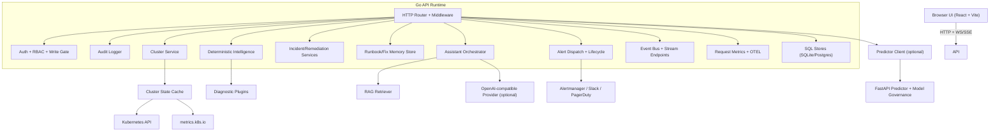

# Architecture

This document describes KubeLens AI runtime components, boundaries, and data flow.
Documentation review refresh: 2026-05-07 (no architecture changes required).

## High-level topology

## Major runtime responsibilities

| Layer                                  | Responsibility                                                    |
| -------------------------------------- | ----------------------------------------------------------------- |
| `src/`                                 | UI shell, view routing, feature views, typed API usage            |
| `internal/httpapi`                     | Transport, middleware, route controllers, streaming endpoints     |
| `internal/auth`                        | Principal extraction, role checks, write-gate policy              |
| `internal/cluster`                     | Kubernetes read/write integration and model mapping               |
| `internal/state`                       | Snapshot cache and watcher-fed cluster state                      |
| `internal/intelligence` + `plugins/*`  | Deterministic diagnostics                                         |
| `internal/rag`                         | Documentation retrieval/ranking and telemetry                     |
| `internal/incident`                    | Incident construction and runbook lifecycle                       |
| `internal/remediation`                 | Proposal generation + controlled execution                        |
| `internal/memory`                      | Persistent runbook and fix pattern storage                        |
| `internal/postmortem`                  | Postmortem generation and storage                                 |
| `internal/db`                          | SQLite/Postgres opening, migrations, and SQL dialect binding      |
| `internal/ghost`                       | Ghost topology, simulation, and durable simulation history        |
| `internal/alerts` + `internal/chatops` | Outbound notifications and alert channels                         |
| `predictor/app`                        | External deterministic risk scoring, ML governance, and telemetry |

## HTTP routing boundaries

The Go API runtime keeps middleware, auth, audit, and shared runtime wiring on `Server`, while route ownership moves into domain controllers as groups mature. `routes_mount.go` composes those controllers under `/api`.

Current controller-owned route groups include:

- `/api/pods` via `PodController`
- `/api/nodes` via `NodeController`
- `/api/resources` via `ResourceController`
- `/api/metrics` via `MetricsController`
- `/api/slo` via `SLOController`
- `/api/rightsizing` via `RightsizingController`
- `/api/audit` via `AuditController`
- `/api/stream` via `StreamController`
- `/api/predictions` via `PredictionController`
- `/api/ghost` via `GhostController`
- `/api/alerts` via `AlertController`
- `/api/experimental*` via server-level experimental handlers

Controllers receive narrow dependencies such as `ClusterReader`, request metrics, clocks, JSON decoders, audit handles, or callback functions. They should not receive the full `Server` unless a route group still requires middleware-level runtime ownership.

## Request/response flows

### Inventory/read flow

1. UI calls `/api/*` inventory endpoints.
2. Handlers query `cluster` service.
3. Cluster service uses cache snapshots and/or live client-go queries.
4. Results are returned as typed `internal/model` contracts.

### Diagnostics/predictions flow

1. Current snapshot is collected from state/cluster service.
2. Deterministic analyzers produce diagnostics.
3. Prediction endpoint calls predictor service when configured.
4. Predictor model health is exposed through `/api/predictor/model`.
5. If predictor is unavailable, backend falls back to deterministic local scoring.

### Assistant flow

1. Assistant request enters `/api/assistant`.
2. Backend assembles deterministic context: diagnostics, cluster state, incidents, memory.
3. Optional RAG references are retrieved and ranked.
4. Optional LLM provider enriches response; deterministic fallback remains available.

### Incident/remediation flow

1. Incident is created from current diagnostics/snapshot.
2. Remediation proposals are generated from diagnostics and linked to incidents.
3. Approved proposals can be executed via guarded write routes.
4. Executed outcomes feed memory fixes and postmortem content.

### Streaming/audit flow

1. Runtime publishes events to in-process bus.
2. Clients subscribe over `/api/stream` (SSE) or `/api/stream/ws` (WebSocket).
3. Request-level and action-level audit entries are persisted in bounded audit storage.
4. Production deployments use `AUDIT_STORE=sql` and `AUDIT_SIGNING_KEY` for durable, signed verification.

### Durable workflow storage

1. Backend startup opens `DATABASE_DRIVER=sqlite` or `DATABASE_DRIVER=postgres`.
2. Automatic migrations create workflow tables when `DATABASE_MIGRATIONS_AUTO=true`.
3. Incident, remediation, postmortem, alert lifecycle, Ghost simulation history, SQL memory, and SQL audit history share the SQL handle.
4. `MEMORY_STORE=file` remains available for demo/local runs; `MEMORY_STORE=sql` is required for production readiness.

### Experimental flow

1. `/api/experimental` reports eBPF telemetry, fleet drift, and autonomous remediation feature gates.
2. eBPF telemetry and fleet drift reports are read-only and disabled by default.
3. Autonomous remediation proposal generation is disabled by default, requires operator role and write gate, and only writes proposal records for later human approval.

## Policy boundaries

- Route-level role requirements are enforced in auth middleware.
- Mutating cluster operations require both sufficient role and `WRITE_ACTIONS_ENABLED=true`.
- Cookie-authenticated mutating requests enforce same-origin CSRF checks.
- In `prod` mode, remediation execution enforces four-eyes separation between approver and executor.

## Operational endpoints

- `GET /api/healthz` - liveness
- `GET /api/readyz` - readiness/dependency checks
- `GET /api/readiness/production` - production blockers, warnings, store posture, dependency posture, and runbook links
- `GET /api/runtime` - runtime security posture summary
- `GET /api/experimental` - experimental feature gate summary
- `GET /api/predictor/model` - predictor model governance summary
- `GET /api/metrics` - JSON API telemetry
- `GET /api/metrics/prometheus` - Prometheus exposition
- `GET /api/openapi.yaml` - API contract
