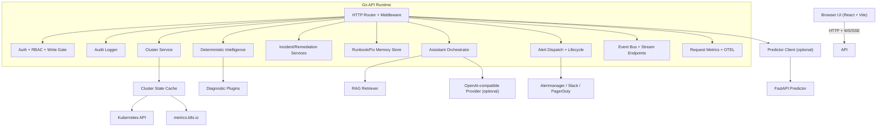

# Architecture

This document describes KubeLens AI runtime components, boundaries, and data flow.
Documentation review refresh: 2026-05-07 (no architecture changes required).

## High-level topology

## Major runtime responsibilities

| Layer                                  | Responsibility                                             |
| -------------------------------------- | ---------------------------------------------------------- |
| `src/`                                 | UI shell, view routing, feature views, typed API usage     |
| `internal/httpapi`                     | Transport, middleware, route handlers, streaming endpoints |
| `internal/auth`                        | Principal extraction, role checks, write-gate policy       |
| `internal/cluster`                     | Kubernetes read/write integration and model mapping        |
| `internal/state`                       | Snapshot cache and watcher-fed cluster state               |
| `internal/intelligence` + `plugins/*`  | Deterministic diagnostics                                  |
| `internal/rag`                         | Documentation retrieval/ranking and telemetry              |
| `internal/incident`                    | Incident construction and runbook lifecycle                |
| `internal/remediation`                 | Proposal generation + controlled execution                 |
| `internal/memory`                      | Persistent runbook and fix pattern storage                 |
| `internal/postmortem`                  | Postmortem generation and storage                          |
| `internal/alerts` + `internal/chatops` | Outbound notifications and alert channels                  |
| `predictor/app`                        | External deterministic risk scoring service                |

## Request/response flows

### Inventory/read flow

1. UI calls `/api/*` inventory endpoints.
2. Handlers query `cluster` service.
3. Cluster service uses cache snapshots and/or live client-go queries.
4. Results are returned as typed `internal/model` contracts.

### Diagnostics/predictions flow

1. Current snapshot is collected from state/cluster service.
2. Deterministic analyzers produce diagnostics.
3. Prediction endpoint calls predictor service when configured.
4. If predictor is unavailable, backend falls back to deterministic local scoring.

### Assistant flow

1. Assistant request enters `/api/assistant`.
2. Backend assembles deterministic context: diagnostics, cluster state, incidents, memory.
3. Optional RAG references are retrieved and ranked.
4. Optional LLM provider enriches response; deterministic fallback remains available.

### Incident/remediation flow

1. Incident is created from current diagnostics/snapshot.
2. Remediation proposals are generated from diagnostics and linked to incidents.
3. Approved proposals can be executed via guarded write routes.
4. Executed outcomes feed memory fixes and postmortem content.

### Streaming/audit flow

1. Runtime publishes events to in-process bus.
2. Clients subscribe over `/api/stream` (SSE) or `/api/stream/ws` (WebSocket).
3. Request-level and action-level audit entries are persisted in bounded audit storage.

## Policy boundaries

- Route-level role requirements are enforced in auth middleware.
- Mutating cluster operations require both sufficient role and `WRITE_ACTIONS_ENABLED=true`.
- Cookie-authenticated mutating requests enforce same-origin CSRF checks.
- In `prod` mode, remediation execution enforces four-eyes separation between approver and executor.

## Operational endpoints

- `GET /api/healthz` - liveness
- `GET /api/readyz` - readiness/dependency checks
- `GET /api/runtime` - runtime security posture summary
- `GET /api/metrics` - JSON API telemetry
- `GET /api/metrics/prometheus` - Prometheus exposition
- `GET /api/openapi.yaml` - API contract
